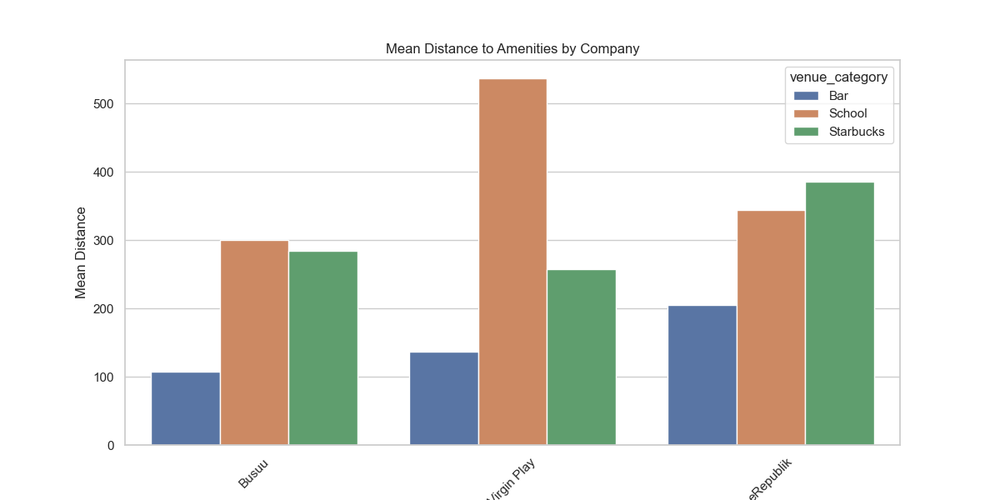
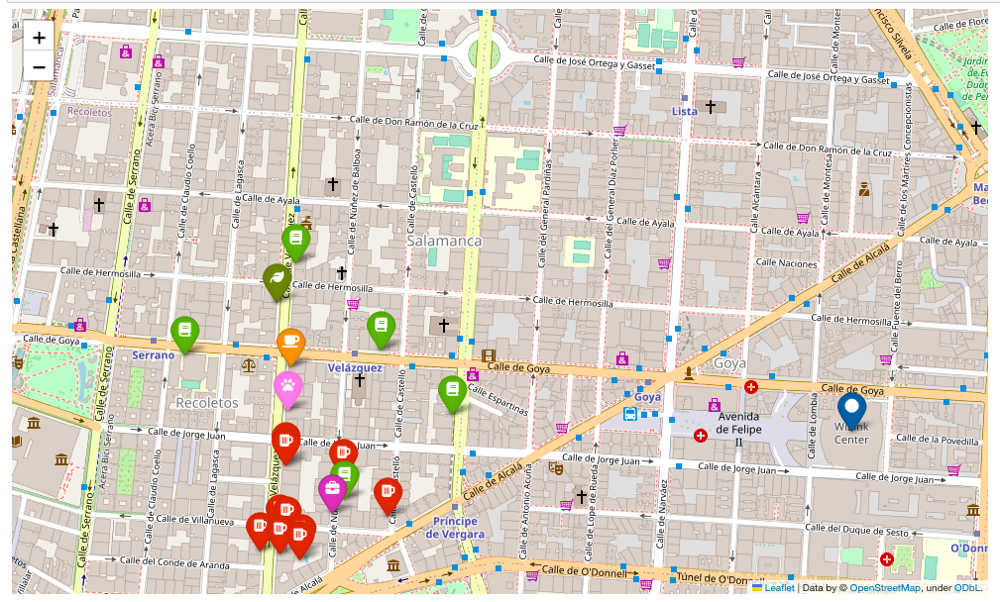

# Project III - Finding the perfect location for a young videogame company #

## Edu Rodger ## 

### Ironhack ###

Everything is in the notebook file, sorry!

### Overview ###

The goal of this project is to use Mongo, folium and foursquare API to choose the ideal location for a video game company to locate its office, based on a set of criteria set by the staff. Taking these criteria into account, I have chosen the offices of a tech company called Busuu, in Madrid, for our company to relocate close to.

### Requirements and libraries ###

Code was written in Python using Jupyter Notebook. The Foursquare API was used, and Mongo was used for querying the dataset of companies. Libraries used:
    - Numpy
    - Pandas
    - Matplotlib
    - Seaborn
    - Requests
    - Folium
    - Getpass
    - Geopandas
    - JSON
    - Pymongo
    - Regex
    
### Workflow ###

Firstly, I ordered the company and staff conditions by importance as follows:

    1. The need for bars and places to party; 100% of the staff is aged 25-40.
    2. The need for schools close by; 30% of the staff have kids.
    
    3. Being close to video game design companies; this is important to the designers (23% of staff)
       Being close to an airport to facilitate travel; important to Account Managers (23% of staff)
       
    4. Being close to successful startups with at least €1M raised; important for developers (17% of staff)
    
    5. Being close to Starbucks - important for executives (11% of staff)
    
    6. Being close to a vegan restaurant for the CEO, a basketabll stadium for the maintenance person, and a dog hairdresser (1 member of staff for each requirement)
    
My workflow followed these steps:

1. Find a city which has both video game design companies and successful startups as a starting point. One of the cities I found was Madrid, which satisfied both of these conditions.

2. I used the 7 Madrid-based companies which were either video game design copmanies or successful startups in the data-base, and used them as comparison points. I found the average distance and minimum distance for the 10 closest bars and 5 closest schools (daycare, primary, or secondary), closest Starbucks, and distance from airport for each. 

These were the 3 'best' taking these criteria into account:

3. Using Folium I made a map of the 'Best' company - Busuu. 

As you can see, it has;

- 10 bars within 150m (Beer Icon)

- 5 schools within 500m (Book Icon, Green)

- Relocating here would put us close to a successful startup like Busuu and other similar companies (Briefcase Icon)

- It has a Starbucks within 300m (Coffee Icon)

- Vegan restaurant within 400m (Leaf Icon, Dark Green)

- Wizink Center, where Real Madrid play Basketball, is 1km (15 mins walk) away (Blue Icon)

- Dog saloon within 300m (Paw Icon)

Not seen in the map: Barajas airport, 12km away, and other companies such as eRepublik, a videogame design company, 20mins walk away. 

### Conclusions###

Therefore, my project shows that the locations of Busuu offices, in Madrid, are the ideal location for this company to move.

